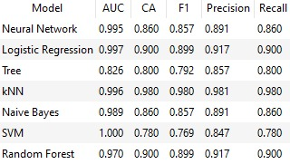
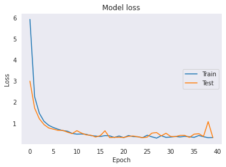

## Modelos de Deep Learning aplicados a imagens médicas como ferramenta no diagnóstico de COVID-19 
## Deep Learning models applied to medical images as a tool in the diagnosis of COVID-19
> Relatório referente ao projeto final da disciplina de Ciência e Visualização de dados em Saúde(IA386X), ministrada no primeiro semestre de 2020 pelo prof. André Santanchè (IC) e prof. Paula Dornhofer Paro Costa (FEEC).

# Descrição do projeto
Diferentes regiões do mundo foram afetadas pelo novo coronavírus. Um grande número de pessoas está ficando doente e estão sendo levadas ao hospital, às vezes em condições críticas de saúde, devido a um dos principais sintomas da doença: pneumonia e insuficiência respiratória. Esta é a principal causa raiz que já levou mais de 500 mil pessoas à morte. Até o momento, a maneira mais confiável de detectar a infecção, o teste "RT-PCR", ainda é escasso e caro, ainda mais quando se trata de regiões subdesenvolvidas ou lugares isolados no mundo. Para ajudar os médicos a detectar com mais facilidade a doença, pessoas de todo o mundo estão se unindo para melhorar o diagnóstico obtido por meio de imagens. Eles estão trabalhando em algoritmos de aprendizado de máquina com o objetivo de tornar o diagnóstico mais rápido e preciso através de métodos mais baratos.

Portanto, este trabalho tem como objetivo propor uma análise de modelos de aprendizado profundo baseados em imagens de raios X e tomografia computadorizada para detectar a doença e também verificar a viabilidade de melhorar modelos já propostos por outras pessoas no campo de pesquisa.

# Abstract
Different regions of the world have been affected by the new coronavirus. A huge number of people are getting sick and beeing taken to the hospital, sometimes in critical health conditions, due to one of the main symptons of the disease: Pneumonia and breath insufficiency. This is the major root cause that has already led more than 500 thousand people to death. So far, the most reliable way to detect the infection, the "RT-PCR" test, is still scarce and expensive, even more when it comes to sub-developed regions or isolated places in the globe. In order to help the doctors detecting more easily the disease, people around the world are coming together for the improvement of the imagaging diagnosis. They're working on machine learning algorithms with the objective of turning the diagnosis faster and more accurate through less expensive methods.

Therefore, this work aims to propose an analysis of deep learning models based on X-ray and Computerized Tomography images to detect the disease and also check the feasibility of improving models already proposed by other people in the research field.

# Equipe
* Eduardo Ferreira - R.A. 139407
* Henrique Orpheu - R.A. 139505
* Leandro Carvalho - R.A. 228595
* Nathan Ribeiro - R.A. 263732

# Vídeo de apresentação do projeto
https://www.youtube.com/watch?v=ps3WlKUGLFw&feature=youtu.be

# Introdução
O ano de 2020 será lembrado por inúmeras gerações futuras devido a epidemia que, inesperadamente, se espalhou mundialmente e se tornou uma pandemia. A doença, causada por um coronavírus nomeado COVID-19, desencadeia uma sindrome respiratória aguda grave (SARS), em específico o Sars-CoV-2. Uma parcela da população que contrai o vírus possui quadro assintomático, porém os que desenvolvem sintomas, acabam sofrendo de infecção pulmonar e necessitam de auxilio de respiradores artificiais para sobreviver. Com a evolução da tecnologia, ferramentas computacionais se tornam utensílios de grande valor para o diagnóstico precoce das doenças.

Segundo [(JIANPNEG et al., 2020)](https://www.researchgate.net/publication/340271344_COVID-19_Screening_on_Chest_X-ray_Images_Using_Deep_Learning_based_Anomaly_Detection), deep learning é uma ferramenta efetiva para auxiliar radiologistas na detecção de anomalias em imagens, por isso, nossa proposta é utilizar imagens de raio-x dos pulmões e de tomografia computadorizada para identificar os casos de COVID-19. Para tal, iremos explorar o uso de modelos de deep learning, com o objetivo de identificar qual o modelo que apresenta melhor performance para a tarefa de classificar imagens de exames realizados e prover uma assistência ao diagnóstico médico rápido.

# Motivação

Uma forma com boa aceitação e confiabilidade para detecção do vírus em pacientes é o teste RT-PCR (do inglês *reverse-transcriptase polymerase chain reaction*). Entretanto, nem todas as nações tem acesso a essa forma de diagnóstico e quando existente, pode ser escasso.

Uma outra forma de realizar o diagnóstico do COVID-19 é através das Tomografias Computadorizadas (CT). Apesar de ser uma boa alternativa à RT-PCR, regiões sub-desenvolvidas podem não ter o equipamento necessário, além de ser um procedimento mais longo do que um exame de Raio-X.
As imagens de Raio-X são uma alternativa de fácil acesso em diferentes regiões do mundo, e são exames rápidos, porém apresentam uma menor eficácia na detecção da doença.

Dessa forma, a principal motivação desse trabalho é utilizar a aprendizagem de máquina para acelerar e aumentar a acurácia da detecção do COVID-19 através de imagens de Raio-X, e assim viabilizar a sua utilização como diagnóstico.

## Perguntas de Pesquisa
* É possível por meio de aprendizagem de máquina e visão computacional, criação de um modelo capaz de classificar imagens de raio-x de exames de COVID-19?
* Dado o que já existe de modelos de aprendizagem de máquina, é possível melhorar a acurácia dos modelos já existentes com o uso de tecnologias/técnicas diferentes (redes neurais, etc)?

## Objetivos do projeto

Nossa proposta é utilizar imagens de raio-x dos pulmões e de tomografia computadorizada para classificar a partir destas imagens, casos de COVID-19.

Para tal, iremos explorar o uso de modelos de redes neurais, aplicadas para a tarefa de classificação de imagens de exames, para de alguma forma, possívelmente auxiliar no diagnóstico médico rápido para casos de COVID-19.

# Recursos e Métodos

## Bases de Dados
Base de Dados | Endereço na Web | Resumo descritivo e uso
----- | ----- | -----
COVID-CT-Dataset: a CT scan dataset about COVID-19 - Zhao, Jinyu and Zhang, Yichen and He, Xuehai and Xie, Pengtao (2020) | https://github.com/UCSD-AI4H/COVID-CT | Dataset com 349 imagens de tomografia computadorizada que contém achados clínicos referentes ao diagnóstico positivo para COVID-19.
COVID-19 image data collection - Cohen, Joseph Paul and Morrison, Paul and Dao, Lan | https://github.com/ieee8023/covid-chestxray-dataset | Dataset com 803 imagens de Raio-X e Tomografia Computadorizada distribuidas em diagnósticos positivos e negativos para COVID-19, nos utilizamos das imagens de Raio-X disponíveis nesta base
"Chest X-Ray Images (Pneumonia)" - Mooney, Paul | https://www.kaggle.com/paultimothymooney/chest-xray-pneumonia | Dataset com 5863 imagens de Raio-X de pulmão com diagnósticos normais e para Pneumonia (viral e bacterial), nos utilizamos deste dataset para aumentar a quantidade de arquivos negativos para COVID-19

## Ferramentas

Ferramenta | Endereço na Web | Resumo descritivo e uso
----- | ----- | -----
Google Colab | https://research.google.com/colaboratory/faq.html | Nos utilizamos das ferramentas disponibilizadas pelo Google Colab para a construção do Notebook com as análises detalhadas que fizemos
Orange Data Mining | https://orange.biolab.si/ | Fizemos uma implementação de modelos de classificação na ferramenta Orange Data Mining para avaliar os resultados de modelos simplificados para a solução do problema de classificação das imagens de COVID-19

# Metodologia

### Afinal, o que é COVID-19?
A COVID-19 é uma doença infecciosa com alto indice de proliferação. Os primeiros casos da doença foram identificados na cidade de Wuhan, na China, no final de 2019 e rapidamente a doença se espalhou pelo mundo. Até o momento, 10 milhões de pessoas foram contaminadas, das quais cerca de 500 mil não sobreviveram.

A doença é responsável por causar a Sindrome Respiratória Aguda Grave (SARS-CoV-2) e sua manifestação mais comum nos pacientes aparenta ser através da Pneumonia. A imagem a seguir mostra exemplos de exames (Raio-X e Tomografia Computadorizada) de COVID-19.

Grande parte dos infectados são assintomaticos porém parte deles necessitam de cuidados intensivos, como respiração artificial, podendo causar colapsos nos sistemas de saúde devido à velocidade de contágio. 

Até o momento (Julho/2020), não foi encontrado um tratamento eficaz para doença e vacinas ainda estão em fase de desenvolvimento.

### Técnicas de imagiologia

O Raio-X é uma das mais importantes ferramentas da Imagiologia para diagnóstico, além de ser um dos metódos mais antigos e disseminados na Medicina. Sua alta acessibilidade e relativo baixo custo de manutenção e utilização tem o tornado uma importante ferramenta para auxílio no diagnóstico do COVID-19, principalmente em regiões sub-desenvolvidas. 

Conceitualmente, o Raio-X é um tipo de radiação eletromagnética com curto comprimento de onda. Isso torna esse tipo de radiação capaz de penetrar diversos meios.  Ao entrar em contato com os tecidos do corpo humano, as ondas são atenuadas de acordo com a densidadede fisiológica dos tecidos. A imagem poderá variar do preto ao branco, a depender da intensidadeda atenuação, onde partes brancas significam total atuanação e pretas, nenhuma atenuação (densidade radiológica). Para fins de diagnóstico de COVID-19 imagens de Tórax são utilizadas, e assim detectar infecções nos pulmões do paciente.

A Tomografia Computadorizada funciona de forma análoga ao Raio-X, utilizando o mesmo tipo de radiação eletromagnética para diagnóstico. A diferença é que na TC, os raios são bombardeados contra o corpo diversas vezes e em diferentes regiões, permitindo a geração de uma imagem em seção tranversal 3D. 

Isso permite a visualização de diferentes níveis de tecidos dentro de um mesmo orgão, além de obter uma maior acurácia na formação da imagem. Em contrapartida, seu uso ao redor do mundo é menos difundido quando comparado ao Raio-X, devido ao maior custo de aquisição quando comparado a um equipamento convencional de Raio-X.

### Técnicas de inteligência artificial

Em nosso projeto utilizamos a técnica denominada *Deep Learning*, ou aprendizado profundo. O *Deep Learning* é considerado um subgrupo do Machine Learning, ou aprendizado de máquina, que por sua vez também é um subgrupo de *Artificial Intelligence*, ou inteligência artificial.

Especificamente, ela tenta reproduzir a ideia das redes de neurônios, ou redes neurais, do nosso cérebro e criar a impressão que o computador está pensando.

Para ser capaz de ensinar o computador a pensar, o *Deep Learning* usa informações inseridas pelo programador para selecionar características semelhantes entre os dados, para que após o processamento, seja capaz de retornar um valor dentre os esperados, como por exemplo, saber classificar uma emoção no texto,  ou realizar reconhecimento de uma face, classificar doenças, atuar como chatbot e outros.

Para que ele seja capaz de agrupar os dados semelhantes, a rede neural é dividida em camadas e cada uma delas é utilizada para conseguir identificar características específicas que mais pra frente serão utilizadas para retornar o resultado. 

Segundo (LECUN; BENGIO; HINTON, 2015), o Deep Learning permite modelos computacionais compostos por múltiplas camadas de processamento aprender representação de dados com múltiplos níveis de abstração, ou seja, descobrir estruturas intrínsecas em grandes quantidades de dados através de algorítimos que interferem nos parâmetros internos das camadas.

### Modelos de Baseline
Para que seja possível avaliar o desempenho de uma rede neural, é preciso criar um modelo de base para servir de comparação. Uma rede neural de baseline realiza essa função, pois identifica o desempenho padrão de uma rede, fornecendo os resultados necessários que servem de base em uma comparação com outras redes neurais, tais como a acurácia de uma classificação, médias e outros cálculos estatísticos.

#### Convolutional Neural Networks
Uma Rede Neural Convolucional (ConvNet / Convolutional Neural Network / CNN) é um algoritmo de Deep Learning que dada uma imagem de entrada, atribui pesos e vieses a objetos da imagem, sendo no final capaz de diferenciar um do outro.

É possível uma rede neural ser bem complexa, e principalmente no *Deep Learning*, seu treinamento se torna ainda mais complicado pela existência de variadas quantidades de camadas ocultas. 

Por isso, uma grande capacidade computacional se torna necessária para que, devido as inúmeras conexões entre os neurônios de uma camada, tenha seus parâmetros ajustados a cada iteração de treinamento. 

Segundo (HENRIQUE BALDI DE ALMEIDA et al., 2018), as redes neurais convolucionais possuem uma diferença fundamental em relação as redes neurais comuns pois na primeira, cada neurônio da camada de entrada equivale ao valor de um dos pixels da imagem e, diferente do que acontece nas redes neurais comuns, essa camada de entrada não é achatada. 

Utilizando uma tecnica de campos receptivos locais, um filtro é passado na primeira camada e executa uma convolução na imagem, que por sua vez resulta em uma função de ativação que é passada para a próxima camada. 

A pré-configuração exigida em uma ConvNet é muito menor em comparação com outros algoritmos de classificação e portanto decidimos que este tipo de rede seria adequada para realizar uma análise incial.

#### Modified XceptionNet

O Xception Network é um tipo de CNN, ela apresenta melhores resultados devido a ideia de que é possível separar em um filtro sua profundidade e dimensão espacial, resultando em um número menor de parâmetros que as camadas de convolução convencionais, sendo assim menos propensas a ocorrer o overfitting.

Esta rede foi desenvolvida com o objetivo de identificar faces modificadas por meio de algoritmos de Deep Fake, entretanto têm mostrado bons resultados para outros domínios de aplicação.

Um exemplo foi a modificação desta rede proposta no artigo "Diagnosis of Coronavirus Disease (COVID-19) from Chest X-Ray images using modified XceptionNet." escrito por Singh, Krishna Kant et al.

Os resultados atingidos por eles no conjunto de imagens que coletaram apresentou resultados excelentes e com o objetivo de avaliar se a performance obtida por eles seria semelhante no nosso conjunto de dados, resolvemos avaliar os resultados.

### Transfer Learning
Criar modelos de Deep Learning do zero pode se tornar uma tarefa complicada e que necessita de muitos recursos computacionais e dados para treinamento.

Desta forma o Transfer Learning surge como uma ferramenta para usufruir de conhecimento e de informações aprendidas por modelos conhecidos e treinados em milhões de dados de treinamento por pesquisadores e empresas.

Nos aproveitamos desta técnica com alguns dos modelos mais conhecidos e adicionamos camadas em seu fim para "especializar o modelo ao novo conjunto de dados".

Nesse projeto escolhemos utilizar a VGG16, a Residual Neural Network (ResNet) e a Efficient Network (EfficientNet).

#### VGG16

A rede VGG16 essa rede neural convolucional foi proposta por A. Zisserman e K. Simonyan em um artigo entitulado "Very Deep Convolutional Networks for Large-Scale Image Recognition". 

A principal contribuição  dessa rede é realizar uma avaliação minuciosa das redes de profundidade crescente usando uma arquitetura com filtros de convolução muito pequenos (3×3), o que mostra que uma melhoria significativa nas configurações da rede em que foi baseada e pode ser alcançada alterando a profundidade e pesos. 

#### Residual Neural Networks

As Residual Neural Networks são indicadas para redes com muitas camadas e seu conceito é alternar propridades de camadas intermediárias, por exemplo a cada 2 ou 3 camadas a fim de minizar a perda do gradiente. 

Essa perda ocorre devido à função de perda calculada em cada etapa e evita que valores próximos a zero afetem o resutlado do aprendizado. A perda desse gradiente acarreta um percentual de erro crescente, influenciando a etapa de treino.

#### Efficient Net

Na Efficient Network, segundo Tan Mingxing e Le V. Quoc, foi feito um estudo sistematico que identificou uma melhor performance da rede neural quando houve um cuidadoso balanceamento de sua profundidade, largura e resolução.

Nos aproveitamos dos aprendizados obtidos por esta rede para avaliar se a mesma poderia gerar bons resultados de acurácia para resolver o problema de classificação de imagens de COVID-19.

## Detalhamento do Projeto

### Orange

O Orange Canvas é uma ferramenta de visualização e manipulação de dados de código aberto, também é uma ferramenta muito usada em machine learning, sua interface gráfica é didática a ponto de qualquer pessoa como o mínimo de conhecimento seja capaz de criar e manipular um modelo de visualização ou até mesmo classificação dos dados.

Nós usamos essa ferramenta para comparar com o nosso modelo criado no Google Colab, como o Orange já tem modelos de machine learnig em sua biblioteca acabamos por usar esses modelos já criados.
Nós usamos a base de dados de imagens de raio x com a divisão de 70% das imagens para treinamento e 30% das imagens para o teste, e obtivemos um resultado satisfatório.

A imagem abaixo mostra a configuração que fizemos para a configuração do pipeline de análise no Orange.

Os resultados obtidos são apresentados abaixo.

# Resultados e Discussão
### Modelos de Baseline
Os resultados obtidos para os modelos de Baseline serão apresentados nesta seção.

#### Convolutional Neural Networks

|              | precision | recall   | f1-score | support |
|--------------|-----------|----------|----------|---------|
| precision    | recall    | f1-score | support  | 80      |
| 0            | 0.92      | 0.97     | 0.95     | 200     |
| 1            | 0.93      | 0.81     | 0.87     | 85      |
| accuracy     |           |          | 0.93     | 285     |
| macro avg    | 0.93      | 0.89     | 0.91     | 285     |
| weighted avg | 0.93      | 0.93     | 0.92     | 285     |

Avaliando os resultados iniciais podemos identificar que mesmo uma rede convolucional simples pode obter uma acurácia alta para o conjunto de imagens de Raio-X de Pulmão, iremos verificar que o mesmo não se repete para as imagens de Tomografia computadorizada.

O uso de redes convolucionais apresenta resultados precisos, com maior recall e f1-score médios, sendo um tipo de rede recomendada para a tarefa de classificar as imagens de Raio-X.

Foi utilizada uma camada de Dropout na saída do modelo para evitar ao máximo o viés e overfitting dos dados no modelo, efetivamente ignorando 20% dos pesos de conexões entre a camada final e a convolucional da rede.

|              | precision | recall   | f1-score | support |
|--------------|-----------|----------|----------|---------|
| 0            | 0.91      | 0.61     | 0.73     | 80      |
| 1            | 0.68      | 0.93     | 0.78     | 70      |
| accuracy     |           |          | 0.76     | 150     |
| macro avg    | 0.79      | 0.77     | 0.76     | 150     |
| weighted avg | 0.80      | 0.76     | 0.76     | 150     |

Diferentemente do conjunto de dados de Raio X, o modelo de rede convolucional aplicado as imagens de tomografia computadorizada apresentou um resultado geral inferior ao anterior, apesar de apresentar uma acurácia média de ~75%, as métricas de precisão, recall e f1-score acompanham os resultados da acurácia.

#### Modified XceptionNet

|              | precision | recall   | f1-score | support |
|--------------|-----------|----------|----------|---------|
| precision    | recall    | f1-score | support  | 80      |
| 0            | 0.98      | 0.97     | 0.98     | 200     |
| 1            | 0.93      | 0.96     | 0.95     | 85      |
| accuracy     |           |          | 0.97     | 285     |
| macro avg    | 0.96      | 0.97     | 0.96     | 285     |
| weighted avg | 0.97      | 0.97     | 0.97     | 285     |

Comparado ao modelo de baseline com redes neurais convolucionais, o modelo modificado da XceptionNet apresentou melhorias frente as métricas de precision, f1-score, recall, atingimos resultados similares aos obtidos pelo artigo descrito anteriormente para o conjunto de dados que selecionamos, desta forma podemos confirmar que o mesmo é adequado para este tipo de classificação em imagens de Raio X.

|              | precision | recall   | f1-score | support |
|--------------|-----------|----------|----------|---------|
| precision    | recall    | f1-score | support  | 80      |
| 0            | 0.94      | 0.38     | 0.54     | 80      |
| 1            | 0.58      | 0.97     | 0.72     | 70      |
| accuracy     |           |          | 0.65     | 150     |
| macro avg    | 0.76      | 0.67     | 0.63     | 150     |
| weighted avg | 0.77      | 0.65     | 0.62     | 150     |

Observando os resultados para as imagens de Tomografia Computadorizada os resultados apresentam uma acurácia baixa se utilizando da mesma arquiteura de modelo, muito possivelmente o conjunto de dados que temos acesso não possui representatividade para obter resultados adequados neste modelo.

### Transfer Learning

#### VGG16

|              | precision | recall   | f1-score | support |
|--------------|-----------|----------|----------|---------|
| precision    | recall    | f1-score | support  | 80      |
| 0            | 0.96      | 0.98     | 0.97     | 200     |
| 1            | 0.96      | 0.89     | 0.93     | 85      |
| accuracy     |           |          | 0.96     | 285     |
| macro avg    | 0.96      | 0.94     | 0.95     | 285     |
| weighted avg | 0.96      | 0.96     | 0.96     | 285     |

Comparado ao modelo de baseline com redes neurais convolucionais e com os resultados da XceptionNet, o modelo baseado na VGG16 apresentou métricas de precision, f1-score, recall equiparados aos obtidos pela XceptionNet, sendo assim, uma alternativa viável também para a classificação de imagens de Raio X.

|              | precision | recall   | f1-score | support |
|--------------|-----------|----------|----------|---------|
| precision    | recall    | f1-score | support  | 80      |
| 0            | 0.83      | 0.89     | 0.86     | 80      |
| 1            | 0.86      | 0.79     | 0.82     | 70      |
| accuracy     |           |          | 0.84     | 150     |
| macro avg    | 0.84      | 0.84     | 0.84     | 150     |
| weighted avg | 0.84      | 0.84     | 0.84     | 150     |

Analisando os resultados da aplicação da VGG16 é possível ver que em comparação com as anteriores ela apresenta uma acurácia um pouco maior para a classificação de imagens de tomografia computadorizada, entretano analisando as curvas de treinamento é possível observar um pouco de overfitting da rede para o conjunto de dados.

Outro ponto interessante é que também é possível observar que o conjunto de imagens de teste/validação do modelo pode não ter representatividade para o propósito da classificação, com um conjunto de dados maior talvez pudessmos atingir melhores resultados com a utilização desta rede.

#### Residual Neural Networks

|              | precision | recall   | f1-score | support |
|--------------|-----------|----------|----------|---------|
| precision    | recall    | f1-score | support  | 80      |
| 0            | 0.00      | 0.00     | 0.00     | 200     |
| 1            | 0.30      | 1.00     | 0.46     | 85      |
| accuracy     |           |          | 0.30     | 285     |
| macro avg    | 0.15      | 0.50     | 0.23     | 285     |
| weighted avg | 0.09      | 0.30     | 0.14     | 285     |

Observando os resultados da rede, observamos que os dados de validação não provém informações suficientes para habilitar o modelo a generalizar os resultados obtidos, isso pode ter ocorrido pelo desbalanceamento das amostras de COVID-19 e imagens normais.

Mesmo com o processo de Data Augmentation, o desbalanceamento pode ter influênciado nos resultados e a utilização de técnicas de ajuste de peso para as classes poderia ajudar a resolver ou minizar o erro do modelo.

|              | precision | recall   | f1-score | support |
|--------------|-----------|----------|----------|---------|
| precision    | recall    | f1-score | support  | 80      |
| 0            | 0.00      | 0.00     | 0.00     | 80      |
| 1            | 0.47      | 1.00     | 0.64     | 70      |
| accuracy     |           |          | 0.47     | 150     |
| macro avg    | 0.23      | 0.50     | 0.32     | 150     |
| weighted avg | 0.22      | 0.47     | 0.30     | 150     |

Assim como no conjunto de imagens de Raio-X o conjunto de dados de tomografia apresentou resultados ruins, neste caso, podemos observar uma pequena melhora na acurácia média do modelo que pode reforça a ideia de que balancear os datasets pode ajudar em resultados positivos.

De qualquer forma, a implementação da rede ResNet no conjunto de imagens que selecionamos apresentou resultados ruins.

#### Efficient Net

|              | precision | recall   | f1-score | support |
|--------------|-----------|----------|----------|---------|
| precision    | recall    | f1-score | support  | 80      |
| 0            | 1.00      | 0.73     | 0.85     | 200     |
| 1            | 0.62      | 1.00     | 0.76     | 85      |
| accuracy     |           |          | 0.81     | 285     |
| macro avg    | 0.81      | 0.87     | 0.80     | 285     |
| weighted avg | 0.89      | 0.81     | 0.82     | 285     |

Comparado ao modelo citados anteriormente, a arquitetura Efficient Net apresentou resultados satisfatórios de acurácia e métricas de precision, f1-score, recall, atingimos relativamente bons.

Entretanto as outras técnicas citadas anteriormente obtiveram resultados melhores para o nosso conjunto de dados e provavelmente têm melhores capacidades de generalização.

|              | precision | recall   | f1-score | support |
|--------------|-----------|----------|----------|---------|
| precision    | recall    | f1-score | support  | 80      |
| 0            | 0.65      | 0.96     | 0.77     | 80      |
| 1            | 0.90      | 0.40     | 0.55     | 70      |
| accuracy     |           |          | 0.70     | 150     |
| macro avg    | 0.78      | 0.68     | 0.66     | 150     |
| weighted avg | 0.77      | 0.70     | 0.67     | 150     |

Assim como nos resultados das imagens de Raio-X, as imagens de tomografia aplicadas ao modelo EfficientNet tiveram resultados bons, entretanto apresentam os mesmos problemas do outro conjunto de dados.

# Conclusões
Com base nas análises, foi possível observar a grande dificuldade em trabalhar com imagens para classificação, além de ser uma tarefa que demanda computacionalmente por se tratar de um grande volume de dados, é ainda mais complexa pelas grande quantidade de modelos disponíveis para trabalhar na classificação de imagens.

Foi interessante notar, que resultados satisfatórios para o conjunto de dados que coletamos foram obtidos por meio da aplicação de técnicas de transfer learning, onde certas camadas de uma rede neural são pré-treinadas em um grande conjunto de dados, e somente aplicadas no dataset em análise após a criação de novas camadas de saída facilita na extração de features relevantes para a classificação.

Em particular tivemos grandes dificuldades para lidar com a grande quantidade de arquivos no ambiente de execução do Google Colab, existe limitações na memória disponível na máquina alocada para processar os dados que gerou a necessidade de por exemplo limitar a quantidade de imagens analisadas e também pode ter sido um fator agravante para a acurácia dos modelos avaliados, em particular, para os conjuntos de dados de tomografia.

Outra dificuldade inicial foi a escolha do conjunto de dados que iriamos utilizar para executar as análises, apesar da grande quantidade de imagens disponíveis, muitas delas estavam hospedadas em servidores chineses que tinham taxas de transferência extremamente baixas. Inicialmente foram testadas outras metodologias para a seleção de dados de treino e teste e que gerou uma baixa acurácia dos resultados e testes efetuados, sendo necessário posteriormente alterar as funções de distribuição para ferramentas mais adequadas oferecidadas por bibliotecas como sklearn e Tensorflow.

Foi interessante observar que camadas convolucionais, comumente usadas na classsificação de imagens convencionais (animais, objetos), tiveram um bom desempenho no conjunto de dados médicos analisados, mesmo que, em arquiteturas simplificadas.

Finalmente, considerando o conjunto de imagens de tomografia computadorizada, chegamos a conclusão de que utilizar métodos de classificação podem não ser as ferramentas mais adequadas para auxiliar no diagnóstico de COVID-19, dado que mesmo as arquiteturas de redes neurais mais complexas apresentarem difulculdades para extrair features das imagens de tomografia computadorizada.

# Trabalhos Futuros

Considerando os trabalhos futuros, poderiamos explorar o ajuste e parâmetros dos modelos treinados, assim como a modificação das camadas inferiores e de saída dos modelos com o objetivo de melhorar os resultados obtidos para as imagens de tomografia. Outra possibilidade seria explorar métodos de segmentação com redes neurais que também ajudariam no objetivo de identificar regiões de atenção nos exames e que seriam ferramentas visuais para o auxílio de médicos no diagnóstico da COVID-19.

# Referências

[HE, X. et al. Sample-Efficient Deep Learning for COVID-19 Diagnosis Based on CT Scans.medrxiv, 2020.](https://github.com/UCSD-AI4H/COVID-CT)

[Kang Zhang, Xiaohong Liu, Jun Shen, et al. Jianxing He, Tianxin Lin, Weimin Li, Guangyu Wang. (2020). Clinically Applicable AI System for Accurate Diagnosis, Quantitative Measurements and Prognosis of COVID-19 Pneumonia Using Computed Tomography.](http://ncov-ai.big.ac.cn/download?lang=en)

[Paul Cohen, Morrison, Dao, et al. COVID-19 Image Data Collection: Prospective Predictions Are the Future, arXiv:2006.11988, 2020 ](https://github.com/ieee8023/covid-chestxray-dataset)

[Kermany, Daniel S., et al. "Identifying medical diagnoses and treatable diseases by image-based deep learning." Cell 172.5 (2018): 1122-1131.](https://www.kaggle.com/paultimothymooney/chest-xray-pneumonia)

JIANPENG, Z. et al. COVID-19 Screening on Chest X-ray Images Using Deep Learning basedAnomaly Detection, 2020

TAN, M.; LE, Q. V.EfficientNet: Rethinking Model Scaling for Convolutional NeuralNetworks. [S.l.: s.n.], 2019. arXiv:1905.11946.
